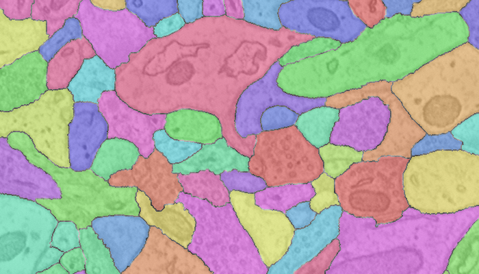
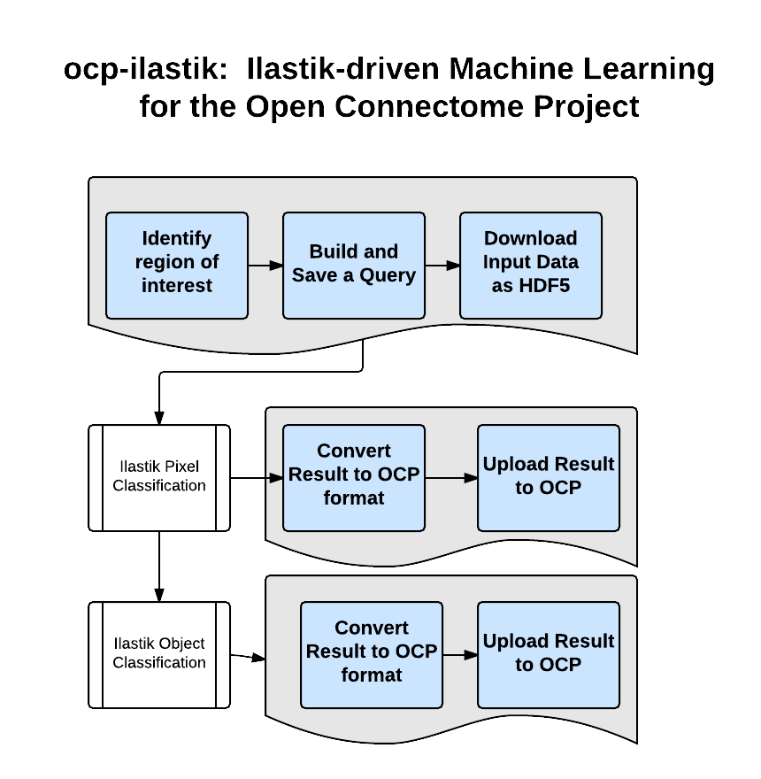
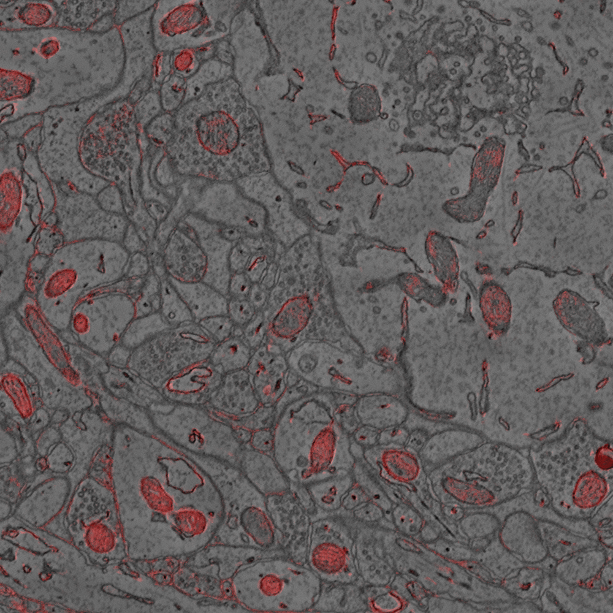

# maca:  Machine Vision Tools for NeuroData

maca provides interfaces for a collection of popular machine learning and computer vision tools used in neuroscience.  This includes ilastik and gala in its initial release.  



## Introduction

A number of tools exist for generating machine annotations (labels) for neuroscience data.  These tools have varying, specific input and output requirements, which makes it difficult to build interoperable pipelines and workflows.

maca provides a series of interfaces to get image data from the NeuroData spatial database, run a machine annotation tool, and convert the resulting annotations to a NeuroData compatible format that can be easily written back to a database project.

As workflows and additional functionalities are developed, we will continue to add to this repository.  

Currently, we provide wrappers for the following tools/capabilities:

- ilastik (Pixel Classification)
- gala (agglomerative segmentation)
- rhoana (multi-hypothesis fusion/segmentation)
- membrane detection

## Configuration

In order to use this truthing protocol, users should have the following software:
 
### General dependencies
 
 - [CAJAL Toolbox](http://github.com/openconnectome/cajal)
 - A recent version of [MATLAB](http://mathworks.com)
 
### ilastik

- [ilastik v1.15+](http://www.ilastik.org/)

### gala


### rhoana


Please follow the instructions with each program to download and install, and setup cajal and ndod (as an installed toolbox).
 For the neurodata tools, you can be up and running with the following commands within MATLAB.  Please replace values inside ```< >``` (including the brackets) with the correct paths for your system.

~~~
run('<cajal root directory>/tools/matlab_install/setupEnvironment.m')
run('<cajal root directory>/cajal.m')
cajal.installToolbox('<ndod root directory>/setup.m')
~~~

*Note that this section is being rewritten to leverage conda and pip, to make the setup process much more streamlined.* 

## Ilastik

ilastik is a tool developed to do machine annotation and is widely used by the connectomics community.
We present a lightweight protocol and data exchange format to allow users to use ilastik and NeuroData together.
This provides an easy method for users to quickly prototype, build, and deploy machine learning solutions
to neuroscience problems.  The figure below outlines a sample workflow.
The initial version of this workflow supports both pixel classification and an object detection step.

The example classifiers presented are used as a capability demonstration, not to demonstrate outstanding
classification performance.  If you would like to contribute a better performing classifier, please contact us.

Ilastik already supports exchanging data in hdf5 format.  The wrappers and functions provided here are used to help
read in raw NeuroData data and format the classifier output into RAMON objects suitable for uploading to NeuroData project databases.

LONI modules and an example workflow exist to enable rapid development.



### Pixel Classification Train

- Identify a region of interest in NeuroData, and note the data server, token, resolution, and coordinates
- Create a query, using the instructions for NeuroData RESTful queries, CAJAL, or ndio (CAJAL: cubeCutoutPreprocessAdvanced.m).
- Download a raw data volume in HDF5 format (CAJAL: cubeCutout.m)
- Using ilastik, build a pixel classifier, following the [Pixel Classification instructions in Ilastik](http://ilastik.org/documentation/pixelclassification/pixelclassification.html)
- Save your ilastik project, containing your trained classifier

### Pixel Classification Deploy

- Identify a region of interest in NeuroData, and note the data server, token, resolution, and coordinates
- Create a query, using the instructions for NeuroData RESTful queries, CAJAL, or ndio (CAJAL: cubeCutoutPreprocessAdvanced.m).
- Download a raw data volume in HDF5 format (CAJAL: cubeCutout.m)
- Classify the volume of interest using [Ilastik in headless mode](http://ilastik.org/documentation/pixelclassification/headless.html)
- Reformat (using ilastikPixelToRAMON.m) and upload results (using CAJAL: cubeUploadProbabilities.m)

#### Ilastik Command:

~~~
<ilastik executable> --headless
--project <project file>.ilp
--output_format hdf5
--output_filename_format <output filename>
<path and filename for raw data>/<hdf5 dataset>
~~~

### Object Detection Train

- Identify a region of interest in NeuroData, and note the data server, token, resolution, and coordinates
- Create a query, using the instructions for NeuroData RESTful queries, CAJAL, or ndio (CAJAL: cubeCutoutPreprocessAdvanced.m).
- Download a raw data volume in HDF5 format (CAJAL: cubeCutout.m).
- Using ilastik, your raw data, and the results from a previous pixel classification step, build an object classifier, following the [Object Classification Workflow](http://ilastik.org/documentation/objects/objects.html).

### Object Detection Deploy

- Identify a region of interest in NeuroData, and note the data server, token, resolution, and coordinates
- Create a query, using the instructions for NeuroData RESTful queries, CAJAL, or ndio.
- Download a raw data volume in HDF5 format
- Create pixel classification outputs using the corresponding ilastik classifier
- Pass pixel classification and raw data inputs into the ilastik object classifier
- Reformat (using ilastikObjectToRAMON.m) and upload results (using CAJAL: cubeUploadDense.m)

#### Ilastik Command:

~~~
<ilastik executable> --headless
--project=<projectfile>.ilp
--export_object_prediction_img
--raw_data <path and filename for raw data>/</hdf5 dataset>
--prediction_maps <path and filename for probability maps>.h5/<hdf5 dataset>
--output_filename_format <output filename>
--output_format hdf5
~~~

### Example

*"I want to add annotations to my dataset."*

This example walks through obtaining data from NeuroData, building classifiers in ilastik and deploying these classifiers in the NeuroData framework.
The definitive documentation is at ilastik.org.  Here we seek to build a lightweight classifier to detect mitochondria in our images.

**For pixel classification in ilastik**

1.  Get datasets for training and test.  These volumes may be obtained via RESTful interface.  One simple option is to copy and paste the following URLs into a web browser.  All volumes should be renamed with an '.h5' extension.

**Pixel Classification Training Volume**

~~~
http://openconnecto.me/NeuroData/ca/kasthuri11cc/hdf5/1/3000,4000/5000,6000/1000,1016/
~~~

Link to first slice

~~~
http://openconnecto.me/NeuroData/ca/kasthuri11cc/xy/1/3000,4000/5000,6000/1000/
~~~

**Pixel Classification Test Volume / Object Detection Training Volume**

~~~
http://openconnecto.me/NeuroData/ca/kasthuri11cc/hdf5/1/3000,4000/5000,6000/1017,1032/
~~~

Link to first slice

~~~
http://openconnecto.me/NeuroData/ca/kasthuri11cc/xy/1/3000,4000/5000,6000/1017/
~~~

**Object Detection Test Volume**

~~~
http://openconnecto.me/NeuroData/ca/kasthuri11cc/hdf5/1/3000,4000/5000,6000/1033,1048/
~~~

Link to first slice

~~~
http://openconnecto.me/NeuroData/ca/kasthuri11cc/xy/1/3000,4000/5000,6000/1048/
~~~

2.  Open Ilastik
3.  Create New Project  > Pixel Classification
4.  Add new data > separate image > <training volume>
5.  Still in the input data tab, right click on dataset description, edit properties -> change storage to save with classifier; change axes to -> zyx
6.  In the feature selection tab, choose some features appropriate to your task (we choose color, edge, and texture with a sigma of 1 for this example)
7.  In the training tab, add two labels, mitochondria and background.  We assume that your target class is the first label, throughout this example *Live prediction can help guide you, but may require substantial memory, especially for large datasets.*
8.  Save project and exit.
9.  Run the Ilastik classifier, following the example above
10. Convert output data to an NeuroData compatible format (probability channel needs to be chosen, xy axes need to be switched, and data should be converted to a RAMONVolume) ilastik object detection requires the raw ilastik output
11.  Upload result to NeuroData, using (using CAJAL: cubeUploadProbabilities.m)

**For object detection in ilastik (depends on pixel classification)**

1.  Open Ilastik
2.  Create New Project > Object Classification with Inputs of Raw Data + Pixel Prediction Map
3.  Load data
4.  In the threshold and size filter tab, we chose only one threshold, with sigma values defaulted to 1. Threshold = 0.7, and size filter = 1000-1000000
5.  In the features tab, select all features
6.  Add labels of mitochondria and background (target/clutter)
7.  In the object classification tab, label detections as either target or clutter
8.  This is sufficient for classification, although subsequent ilastik steps may help improve classifier performance.
9.  Save project and exit ilastik.
10.  Run the Ilastik classifier, following the example above
11.  Convert output data to an NeuroData compatible format (xy axes need to be switched and array squeezed.  Making unique objects is handled in the next step)
12.  Group objects by connected component and upload to NeuroData using (using CAJAL: cubeUploadDense.m)

**Sample classifiers:**

~~~
./data/ilastik_mito_pixelclassification.ilp
./data/ilastik_mito_objclassification.ilp
~~~

Sample results:

~~~
http:///NeuroData/overlay/0.4/test_ilastik_prob1/xy/1/7000,8000/8500,9500/1010/
~~~




### Advanced Topics/Future Functionality

- When uploading annotations processed as many small cubes, often some sort of padding or stitching operation is required.  These will differ slightly depending on use cases.  Examples exist (e.g., i2g, vesicle) to use as a starting point
- When running in an SGE cluster environment, we suggest limiting threads to 1 and RAM to the value specified in LONI to allow ilastik lazy operations to co-exist smoothly with SGE.  To do this, specify the following environment variables:  LAZYFLOW_THREADS=1 LAZYFLOW_TOTAL_RAM_MB=8000 run_ilastik.sh --headless ...


## Gala
Coming soon!

## Rhoana
Coming soon!

## Support

If you have questions about ndod, or have data to analyze, let us know:  support@neurodata.io
