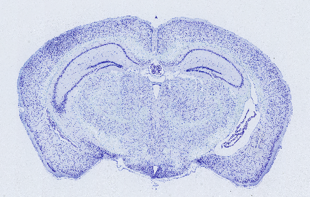
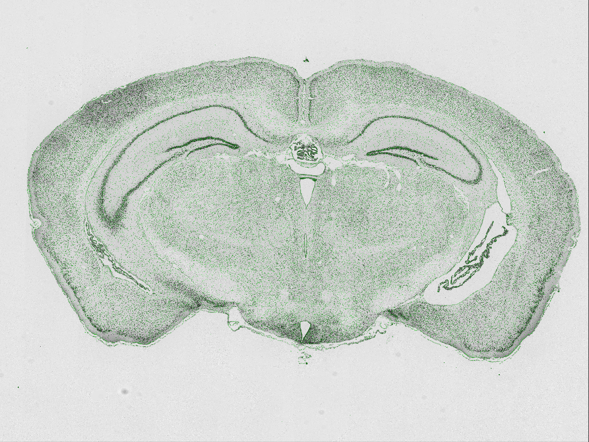
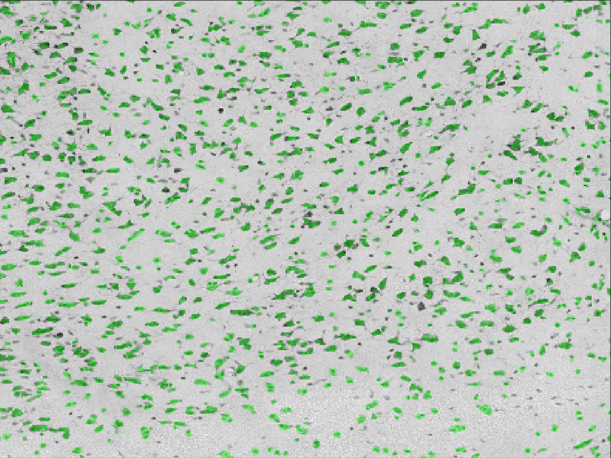

# Mouse Brain Cell Detection Pipeline Deliverable

**January 15, 2016**

*JHU/Applied Physics Laboratory Technical Report and Readme*

To enable the detection of cell clusters at scale, we have developed a generalizable, open source framework.  This framework leverages community tools and custom-built code to efficiently and effectively provide scientific results.

Due to the limited ground truth available (especially dense ground truth) at this time, the focus of this handoff is on providing capability, rather than performance, although we have provided related tools and an assessment methodology that can be expanded as truthing data mature.

This tutorial assumes you have access to a nissl stained brain, which may be requested from Cold Spring Harbor Laboratories.  A single slice is shown below. 

This tutorial exists completely standalone from the spatial databases and web backend of neurodata to facilitate computation on large data volumes.  Other tutorials exist within this documentation for distributed computing in NeuroData (including gets/puts of data and annotations).  
 
In the standalone mode, users specify a directory location where their images reside, and use the included scripts to save files in a format compatible with downstream processing.  The results are saved in a specified output directory for future analysis.  

Users can then choose an image processing or machine vision tool (deep learning with pyCaffe, ilastik, or a MATLAB pre-screening tool), and save the probabilities to disk.  To convert these images to cell clusters, one can threshold and run a connected components analysis on the probability maps.  An optional prototype to compute statistics on each cluster is provided.

## ndod

The standalone code to process these brains has been integrated into ndod, the NeuroData Object Detection Pipeline, and is available for use.  Links are provided throughout this document.  

Tutorials for general ndod usage are provided [here](http://docs.neurodata.io/nddocs/index.html#parse).  There are three modules in our strategy of parsing neurodata:  manual annotation (mana), machine annotation (maca), and max annotation, which contains our reference deployment code (maxa).

## Demo

To follow along with the examples in this tutorial, users should first download example classifiers and data [here]().

## Data Input/Output

The data is first converted to a common format.  Reference code is avaiable to take in a directory of JP2 files and output TIF slices for convenience.  This function can be found in ndod/io, and can be easily adapted to other use cases.  The existing function facilitates the conversion, downsampling and grayscale conversion for downstream processing, as user-modifiable parameters.

The functions and examples referenced in this section can be found in the maca repo in [io](https://github.com/openconnectome/maca/packages/io/).

## Manual Annotation

Prior to training a classifier, dense ground truth is needed.  We provide a tool called [mana](http://docs.neurodata.io/nddocs/mana/) to annotate ground truth.  This interfaces with ITK-Snap and a well-defined protocol that has been used for many neuroimaging tasks.

The functions and examples referenced in this section can be found in the maca repo in [io](https://github.com/openconnectome/maca/packages/io/).

## Machine Annotation (Pixel Classification)

For the core processing task of cell cluster detection, we provide two primary options: [ilastik](http://ilastik.org) (a random forest based classifier based on texture and image features), and a deep learning method based on [pyCaffe](http://caffe.berkeleyvision.org/).

### Ilastik

For processing in ilastik, users can most simply train a classifier or use the one provided, and use the ilastik GUI to batch process an entire brain.

Unfortunately, it is memory-intensive (and prohibitive for smaller workstations) to operate on an entire brain in memory, and so we provide examples of using ilastik in a batch mode in [maca](http://docs.neurodata.io/nddocs/maca/).

In brief, users have two choices: either a command line bash call or a python option.  We recommend processing on a single slice of brain and writing a wrapper to loop through directories of interest suitable for your local computational environment.  More details are explained at the above link.

Ilastik will work with grayscale or RGB images.  A script is provided [here](https://github.com/openconnectome/maca/packages/io/) to take ilastik hdf5 probability output and convert to tif as a convenience function.

#### Bash

This option should "just work" if you have ilastik on your system.  We have tested using OSX and Linux.  Ilastik 1.1.8 is recommended.

~~~
#<ilastik executable> --headless
#--project <project file>.ilp
#--output_format hdf5
#--output_filename_format <output filename>
#<path and filename for raw data>/<hdf5 dataset>
~~~

#### Python

This option requires additional configuration that is system dependent.  We recommend conda.  Users may also need to install vigra.

~~~
# Install
conda create -n ilastik-devel -c ilastik ilastik-everything-but-tracking

# Run
CONDA_ROOT=$(conda info --root)
${CONDA_ROOT}/envs/ilastik-devel/run_ilastik.sh
~~~

~~~
# Example of running a single tif file 
# through default ilastik classifier.

inputImage = '/Users/graywr1/code/PMD2040/PMD2040_rgb/PMD2040_0100_rgb_025.tif'
ilpfile = '/Users/graywr1/code/PMD2040/Training_new.ilp'

import ilastik, ilastik_main
import os

#Override lazyflow environment settings
os.environ["LAZYFLOW_THREADS"] = "4"
os.environ["LAZYFLOW_TOTAL_RAM_MB"] = "4096"
parsed_args, workflow_cmdline_args = ilastik_main.parser.parse_known_args()

parsed_args.headless = True
parsed_args.project='/Users/graywr1/code/PMD2040/Training_new.ilp'

workflow_cmdline_args = [inputImage]

print workflow_cmdline_args
ilastik_main.main(parsed_args, workflow_cmdline_args)

~~~

An example of thresholded detections are shown below, as an entire slice and zoomed in as a detail view:

### Deep Learning

Please see the [nddl Deep Learning page here]().  Note that the current version of deep learning was designed to run with the provided point-based ground truth and is grayscale, although the method itself is agnostic.

## Post Processing (Object Detection)

The primary purpose of this tutorial is to generate cluster of cell detectoins.  However, we provide a simple function threshold, perform connected components, and extract basic statistics from each cluster.  

This function may actually be used in two ways:  
- as an object detection post-processing step
- as an image processing data-reduction step to filter putative cell cluster locations based on intensity.  This offers the possibility of a dramatic reduction in processing time, as far fewer pixels will need to be evaluated.  Because the deep learning methods are especially computationally expensive, users might wish to use this step to remove background and other pixels that are very unlikely to contain target from a classifier testing paradigm. 

## Outlook and Engineering Recommendations

Finding cell clusters in nissl-stained images can be complex at scale, but the tools provided give two distinct options for processing.  These tools exist as standalone modules, which can be easily integrated into a processing chain suitable for a user environment.  

Two possible options for scalable frameworks are the [LONI Pipeline](), which runs in standalone or cluster mode and is used across a variety of NeuroData projects.  A second option would be to create an end to end Python "driver," which has three distinct steps:  data input, pixel classification, and object-detection/post-processing.  The code referenced in this example is python and MATLAB based; a wrapper for calling matlab functions from Python is available [here]().

To improve the results, we recommend two actions for future work:
- the creation of dense ground truth suitable for training and evaluation
- work to separate cell clusters - [SLIC]() based on putative cell sizes might be an easy first step; also framing the problem as a deep learning regression problem might be fruitful. 

Finally, although this effort was more focused on capability creation rather than performance, the precision-recall code [here](), may be useful in computing metrics once the classifiers are finalized.  This code is generalizable and attempts to account for some common failure modes like double -counting truth objects.  

